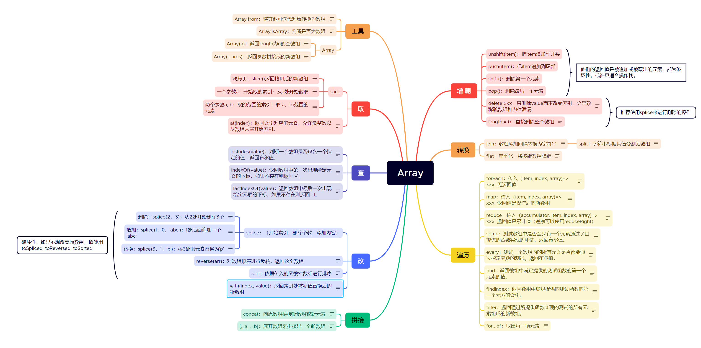

我又来了！今天我们将对JavaScript数组进行一个系统性的总结，涵盖所有常用方法以及面试中可能加分的高级方法，全面俯瞰数组的知识点，希望能为你带来新的收获！


首先送上一个全面涵盖所有数组方法的思维导图：




[下载链接](https://hxmzy.lanzoue.com/iEyXD21datta)

点击右侧可以直接查看用例~


点个赞，我们正式开始~


## 说说JS数组有哪些方法？

首先我们知道，有些方法调用会修改原数组，叫破坏性方法，有些会返回修改后的新数组不会破坏原数组，叫非破坏性方法。

MDN称之为`Copying methods and mutating methods`，直译为复制方法和变异方法，官网译作复制方法和修改方法。


那么用破坏性分类，有4+3+1个破坏性方法，其余全是非破坏性：

**4**：`unshift`、`push`、`shift`、`pop`四个用来在头尾增删元素。

**3**：`splice`、`reverse`、`sort`三个用来修改数组，值得一提的是在ES2023中引入了他们的非破坏性版本（返回修改后的新数组）：`toSpliced`、`toReversed`、`toSorted`。

**1**：fill，用传入的值填充数组从头到尾全部元素。

破坏性其实还有一个[`copyWithin()`](https://developer.mozilla.org/zh-CN/docs/Web/JavaScript/Reference/Global_Objects/Array/copyWithin)方法，由于太不常用这里不提。


其余还有用于遍历的、查找的、数组与字符串转换的等等。大家自己可以去导图里面查漏补缺。

不过说实话常用的还是那么几种，高级的算法往往用朴素的API实现。良好的代码还要兼顾可读性，代码是要给人看的，不是让你秀的~


## Array静态方法

### `Array.from`

`Array.from` 是一个静态方法，用于将类数组对象或可迭代对象（这两个下面会讲）转换为数组。

#### 转换与遍历

一个很常见的例子，`document.querySelectorAll`返回的节点列表是一个类数组，如果你想要使用数组原型上的方法，你要先将其转为数组：


```js
Array.from(document.querySelectorAll("p"))
//这样就可以使用map、find等方法了。
```

`Array.from`接收的第二个参数是可选的，可以传入一个`mapFn`，相当于把数组的`map`塞到里面：

```js
Array.from(document.querySelectorAll("p"), (item,index) => // 返回值)
//等同于
Array.from(document.querySelectorAll("p")).map((item,index) => // 返回值)
```

不过要注意的是，这里的`map`就没有第3个参数`array`了，因为数组还在初始化你怎么拿嘛。

#### 替代`for`循环


##### 初始化

面试官：来给我快速初始化一个长度为n，值为索引*2的数组：

```js
const n = 10;
const arr = Array.from({length:n},(_,i)=>i*2)
```


我：并且这样做性能是可能优于用for循环创建的，如果我们用for循环初始化一个length为1000000的数组：


```js
const array = [];
for (let i = 0; i < 1e6; i++) {
  array.push(i);
}
```


V8 引擎中对数组的实现和我们学习程序设计时使用的 `malloc` 类似，同样是分配一个连续的内存空间来存储数组元素。引擎很难知道我们要往里面填入 1000000 个元素，而且默认情况下分配的内存空间只能容纳数十个元素，当我们使用 `push` 函数添加更多元素时，V8 引擎会重新分配一个更大的内存空间，并将原来的元素复制到新的内存空间中。

因此，使用 `for` 循环会使 V8 引擎进行多次内存分配和复制，严重拖慢了速度。而使用 `Array.from({ length: N })` 时，引擎可以根据给定的 `N` 事先分配好一个巨大的连续内存空间，不需要再进行多次的内存分配和复制。


面试官：......太牛皮了！

##### 假冒数组

我们还可以使用`Array.from`的特性代替`for`循环，通过假冒一个数组的形式：

```js
// 代替for循环
Array.from({length:10},()=>{
    // ......
})
```

#### `this`绑定

不细说了，知道有第3个参数能绑定`this`就好。


### `Array.isArray`

判断给定参数是否为一个数组。

非常推荐的方法，很多库都在使用~

### `Array`构造函数

需要注意参数：
- Array(n)：返回length为n的空数组
- Array(...args)：返回参数拼接成的新数组


```js
Array(10)
> (10) [空 ×10]

Array(10,2)
> (2) [10, 2]
```


## 可迭代对象(iterable)

可迭代对象是实现了 `@@iterator` 方法的对象，这个方法是通过对象的 `Symbol.iterator` 属性来访问的。任何实现了 `@@iterator` 方法的对象都可以使用 `for...of` 循环遍历其元素。


**可迭代对象**有：
- 数组、字符串、`Map`、`Set`都是可迭代对象。
- [`arguments`](https://developer.mozilla.org/zh-CN/docs/Web/JavaScript/Reference/Functions/arguments) 对象和一些 `DOM 集合`类型，如 [`NodeList`](https://developer.mozilla.org/zh-CN/docs/Web/API/NodeList) 也是可迭代的。


**迭代操作**有：

-   JavaScript 中语法：`for ...of`、展开语法（spread syntax）、`yield*`、解构赋值；

-   创建某些对象：`new Map([Iterable])`、`new WeakMap([iterable])`、`new Set([iterable])`、`new WeakSet([iterable])`;

-   部分方法的调用：`Promise.all(iterable)`、`Promise.race(iterable)`、`Array.from(iterable)`


如果传入参数没有实现`@@iterator` 方法，就会直接报错。


来看这道面试题：


```js
const [a,b] = {a:1,b:2}
// 怎么不报错并且让a赋值为1，b赋值为2？
```

Object内部没有迭代器，那么我们只需要把数组的迭代器拿过来就好了：


```js
const [a,b] = {
    a:1,
    b:2,
    [Symbol.iterator](){
        const arr = [1,2];
        return arr[Symbol.iterator]();
    }
}

```


## 类数组(Array-like)


类数组对象是那些具有类似数组的属性（如 `length` 和按索引访问元素的能力），但并不真正是数组的对象。类数组对象通常是普通对象，可以用Array.from被转换为真正的数组。

常见的类数组对象有：**函数参数对象**（arguments）、**DOM 集合**等。

### arguments

`arguments` 对象是所有（非箭头）函数中都可用的**局部变量**。你可以使用 `arguments` 对象在函数中引用函数的参数。

`arguments` 对象具有以下属性：

-   `length`：表示传递给函数的参数个数。
-   `callee`：引用当前正在执行的函数。

此外，`arguments` 对象实现了 `Symbol.iterator`，使得它是可迭代的，可以使用 `for...of` 循环遍历参数。

### DOM 集合

使用`document.getElementsByName`、`document.querySelectorAll`等方法会返回一个`DOM集合`，这个集合实现了类似数组原型上的`forEach`：

```js
let nodeList = document.querySelectorAll('div');
nodeList.forEach((node) => {
    console.log(node);
});
```

虽然 DOM 集合看起来像数组，但它们实际上是 `NodeList` 或 `HTMLCollection` 对象。

### 类数组转换真数组


#### 转换的各种方式
-   **`Array.from` 方法**

    `Array.from` 是将类数组对象转换为真正数组的最常见方法。

    ```js
    const arrayLike = { 0: 'a', 1: 'b', 2: 'c', length: 3 };
    const realArray = Array.from(arrayLike);
    console.log(realArray); // ['a', 'b', 'c']
    ```

-   **扩展运算符（Spread Operator）**

    扩展运算符也可以将类数组对象转换为数组，但前提是该对象是可迭代的。

    ```js
    const arrayLike = document.querySelectorAll('div');
    const realArray = [...arrayLike];
    console.log(realArray);
    ```

-   **`Array.prototype.slice` 方法**

    `slice` 方法是旧式但仍然有效的方法。

    ```js
    function exampleFunction() {
        const argsArray = Array.prototype.slice.call(arguments);
        console.log(argsArray);
    }

    exampleFunction(1, 'a', true); // [1, 'a', true]
    ```

不过对参数`arguments`使用 `slice` 会阻止某些 JavaScript 引擎中的优化 (比如 V8 - [更多信息](https://github.com/petkaantonov/bluebird/wiki/Optimization-killers#3-managing-arguments))。


#### 不转换使用call/apply

有时不需要将类数组对象转换为真正的数组，可以直接使用 `call` 或 `apply` 调用数组的方法。这对于只需要临时使用数组方法时特别有用。

```js
function exampleFunction() {
    Array.prototype.forEach.call(arguments, arg => {
        console.log(arg);
    });
}

exampleFunction(1, 'a', true); // 输出 1, 'a', true
```


## 稀疏数组(Sparse Array)

数组可以包含“空槽”，这与用值 `undefined` 填充的槽不一样。空槽可以通过以下方式之一创建：

### 稀疏数组的产生

```
// Array 构造函数：
const a = Array(5); // [ <5 empty items> ]

// 数组字面量中的连续逗号：
const b = [1, 2, , , 5]; // [ 1, 2, <2 empty items>, 5 ]

// 直接给大于 array.length 的索引设置值以形成空槽：
const c = [1, 2];
c[4] = 5; // [ 1, 2, <2 empty items>, 5 ]

// 通过直接设置 .length 拉长一个数组：
const d = [1, 2];
d.length = 5; // [ 1, 2, <3 empty items> ]

// 删除一个元素：
const e = [1, 2, 3, 4, 5];
delete e[2]; // [ 1, 2, <1 empty item>, 4, 5 ]
```

### 稀疏数组的表现

1.  **长度计算**：

    数组的 `length` 属性总是返回数组中最大索引值加 1，即使是稀疏数组。

    ```
    javascript
    复制代码
    const sparseArray = [];
    sparseArray[5] = 'a';
    console.log(sparseArray.length); // 6
    ```

2.  **遍历**：

    在遍历稀疏数组时，某些方法会跳过空隙，而某些方法会考虑到空隙。

 `forEach`、`map`、`filter` 等方法会跳过空隙：

```js
const sparseArray = [1, , 3];
sparseArray.forEach((item, index) => console.log(item, index));
// 1 0
// 3 2
```

在这3种操作中，会被视为undefined：

 ```js
const arr = [1, 2, , , 5]; // 创建一个稀疏数组

// 通过索引访问
console.log(arr[2]); // undefined

// For...of
for (const i of arr) {
  console.log(i);
}

// 输出：1 2 undefined undefined 5

// 展开运算
const another = [...arr]; // "another" 为 [ 1, 2, undefined, undefined, 5 ]
```


 `Object.keys` 方法会返回数组中所有有效索引：

```js
console.log(Object.keys(sparseArray)); // ['0', '2']
```

3.  **空隙元素**：

    //空隙在数组中实际上并不存在值（甚至不是 `undefined`）。它们仅仅是空的。

```js
const sparseArray = [1, , 3];
console.log(1 in sparseArray); // false
console.log(sparseArray[1]); // undefined
```

### 注意事项

-   性能：某些操作在稀疏数组上可能比在密集数组上更慢。

-   可读性：稀疏数组可能会使代码变得不直观和难以维护。

-   容易出错：由于空隙的存在，在遍历和操作稀疏数组时需要特别小心。


喜欢就点个赞吧~


参考：

[如何在 JavaScript 中优雅地创建并初始化数组 · Darky's Blog (darkyzhou.net)](https://darkyzhou.net/articles/js-array-creation/)

[Iterator-Generator 迭代器和生成器 - 掘金 (juejin.cn)](https://juejin.cn/post/7148443965388718093)

[关于js迭代器的一个面试题 - 掘金 (juejin.cn)](https://juejin.cn/post/7346512120639832127)


